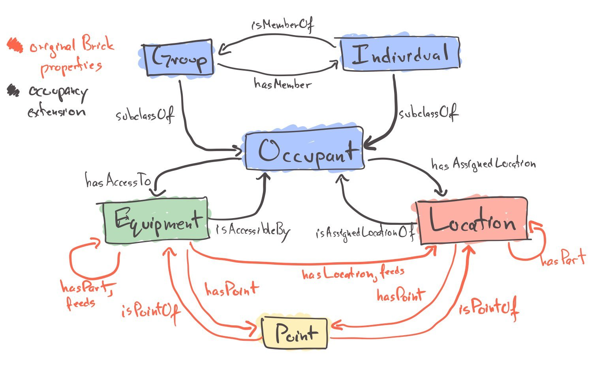
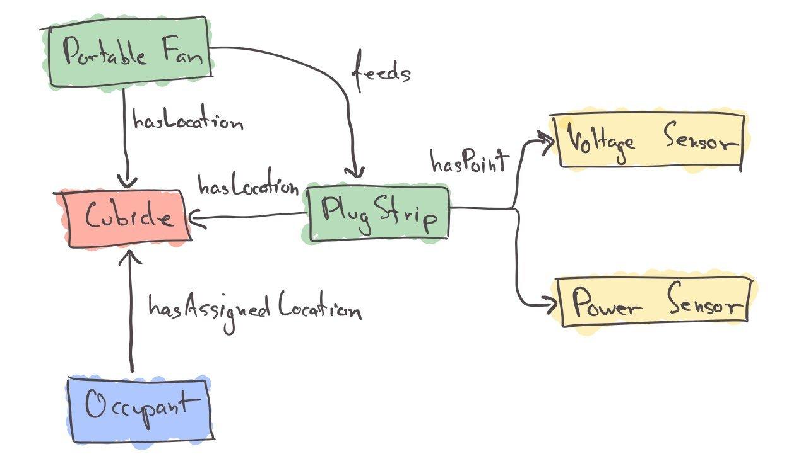

# Occupancy Modeling Extension



Docs available [here](https://occupancy-extension-beta.gtf.fyi/)

Look at the `.ttl` files for the ontology extension definition. Look at `example1.ttl` for usage. Look at `sample_queries.py` for what it says on the tin.

## Occupants

The extension introduces some classes for describing properties of the building occupants. An `Occupant` is any individual or group of individuals. An `Individual` is a subclass of Occupant corresponding to a single individual. A `Group` is also a subclass of `Occupant`.

Occupant Properties:
- `occ:isMemberOf <Group>`: an occupant can be a member of a group. This allows nested groups
- `occ:hasAccessTo <Equipment>`: an occupant can use equipment.
- `occ:label <string>`: a human-readable label associated with the occupant
- `occ:age <value>`: the age of an occupant given as a range or exact value. Can be in years, months, days, etc
- `occ:clothingInsulation <value>`: the clothing insulation level of an occupant, in `clo`
- `occ:gender <value>`: the surveyed gender of an occupant
- `occ:ethnicity <value>`: the surveyed ethnicity of an occupant

Individual Properties:
- An individual can have any or all of the properties associated with an Occupant

Group Properties:
- A group can have any or all of the properties associated with an occupant, including...
- `occ:hasMember <Occupant>`: the inverse relationship of `occ:isMemberOf`
- `occ:groupSize <integer>`: the number of individuals in a group

### Surveyed Values

For items like age range, gender and ethnicity it is important to capture not just the value that was surveyed, but also the range of values that was contained in the survey. A possible way of modeling this has been done for `AgeRange`, but not for `ethnicity` or `gender` (yet).

How does it work? An `occ:AgeRange` class is declared with several pre-declared instances: `occ:18_25`, `occ:26_34`, `occ:35_50` and `occ:51_plus`. There are annotations on these instances which explicitly denote the upper/lower bounds of each age range, but I'll omit that here for simplicity. In the `example1.ttl` file, the value of the `occ:ageRange` property for an Occupant entity is one of these range instances. For surveys with *different* ranges, the data graph should define its own classes with the `occ:upperBound` and `occ:lowerBound` properties to denote what the actual age ranges are.

## Equipment

The extension introduces several new classes of equipment:

- Ceiling Fan
- Personal Devices:
    - Portable Fan
    - Portable Heater
    - Desktop Light
- Envelope Equipment:
    - Door
    - Window
- Plug Meter

The extension supports several kinds of annotations on equipment entities:
- `occ:modeOfControl`: manual, dynamic or automatic
- `occ:degreeOfControl`: on/off, continuous, staged, none
- `occ:occupantAccessibility`: shared, adjustable or not accessible
- `occ:isAccessibleBy <Occupant>`: denotes which occupants, individuals or groups make use of an equipment. If at least 1 occupant has access to an equipment, the ontology will infer the `Adjustable` property for the equipment. If at least 2 occupants have access to an equipment then the ontology will also infer the `Shared` property.

### Plug Meters

Plug meters are a new class of equipment that is a subclass of `brick:Electrical_Meter`. Plug meters have their data sources related to them through `brick:hasPoint`: this is how to model voltage, current, power, energy and other kinds of sensors with a meter. To indicate which piece of equipment is measured by the plug meter use `brick:isFedBy` (the equipment "feeds" electricity to the meter). Plug meters are related to a cubicle, floor, room or other location via `brick:hasLocation`.



```ttl
@prefix brick: <https://brickschema.org/schema/Brick#> .
@prefix occ: <https://brickschema.org/schema/Brick/extension/occupancy#> .
@prefix unit: <http://qudt.org/vocab/unit/> .
@prefix ex: <urn:example#> .

ex:Cubicle123   a   brick:Cubicle ;
    brick:isLocationOf ex:DeskFan1, ex:Cubicle123PowerMeter .

ex:DeskFan1 a   brick:Portable_Fan ;
    brick:feeds ex:Cubicle123PowerMeter .

ex:Cubicle123PowerMeter a brick:PlugMeter ;
    brick:hasPoint  ex:volt_sensor_1, ex:power_sensor_1 .

ex:volt_sensor_1    a   brick:Voltage_Sensor ;
    brick:hasUnit   unit:V ;
    brick:timeseries [
        brick:hasTimeseriesId   "ac3a9e-c4e9-11eb-ae8d-1002b58053c7" ;
    ] .

ex:power_sensor_1    a   brick:Power_Sensor ;
    brick:hasUnit   unit:W ;
    brick:timeseries [
        brick:hasTimeseriesId   "571811de-c4e9-11eb-ae8d-1002b58053c7" ;
    ] .
```

## Points

The extension introduces a new kind of Point class which models streams of occupant actions. An instance of a `occ:OccupantActionStream` represents the sequence of actions taken by an occupant (which may be an individual or a group) on an equipment. This is different than a Point containing data of the equipment status such as a `brick:Status` or `brick:Command`. An `occ:OccupantActionStream` contains the results of occupant actions; a `brick:Status`/`brick:Command` contain the current read-only state of equipment  and read-write state of equipment, respectively.

Specifically, the `occ:OccupantActionStream` instance has the following metadata:
- the `occ:Occupant` instance taking the action (related with the `brick:isPointOf` relationship)
- the `brick:Equipment` instance that is the object of the action (related with the `brick:isPointOf` relationship)
- a `occ:csvReference` property denoting the name of a CSV file containing the data and which column contains the data for this point. Alternative to `occ:csvReference` is [`brick:timeseries`](https://docs.brickschema.org/metadata/timeseries-storage.html) which relates a Point instance's data to the contents of a database

The *values* of the data stream are the **resulting state of the equipment after the occupant took an action**.

### Needs Additional Discussion

Is there a better/standard way of describing the data stored in a tabular form?

- https://link.springer.com/content/pdf/10.1007/s10115-020-01468-x.pdf
- https://www.w3.org/TR/r2rml/
- https://github.com/w3c/csvw/

### Example

For example, consider a file `Occupant1DeskFanActions.csv` which contains the following data:

```
timestamp,action
2021-04-01T08:00:00Z,on
2021-04-01T09:00:00Z,off
2021-04-01T09:10:00Z,on
```

then this would possibly be modeled in a `.ttl` file as:

```ttl
@prefix brick: <https://brickschema.org/schema/Brick#> .
@prefix occ: <https://brickschema.org/schema/Brick/extension/occupancy#> .
@prefix ex: <urn:example#> .

ex:Building a   brick:Building ;
    brick:hasPart   ex:Floor1 ;
.

ex:Floor1   a   brick:Floor ;
    brick:hasPart   ex:Office1 ;
.

ex:Office1  a   brick:Office ;
    occ:isAssignedLocationOf ex:Occupant1 ;
    brick:isLocationOf  ex:DeskFan1 ;
.

ex:DeskFan1 a occ:Portable_Fan ;
    occ:isAccessibleBy  ex:Occupant1 ;
.

ex:Occupant1    a   occ:Individual ;
    occ:label "Occupant 1" ;
    occ:hasAssignedLocation ex:Office1 ;
.

ex:Occupant1FanActions  a   occ:OccupantActionStream ;
    brick:isPointOf ex:Occupant1, ex:DeskFan1 ;
    occ:csvReference [
        occ:fileName "Occupant1DeskFanActions.csv" ;
        occ:dataColumnName "action" ;
        occ:timeColumnName "timestamp" ;
    ] ;

```
